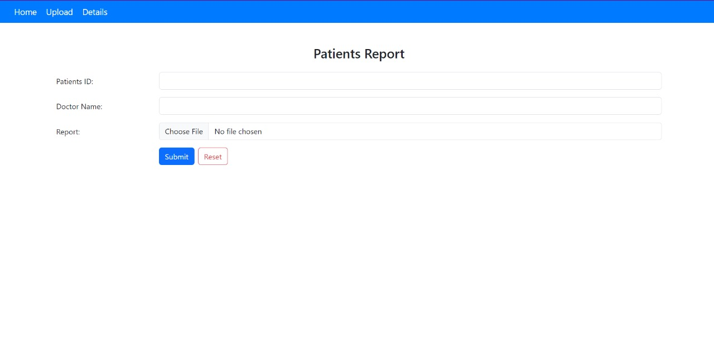
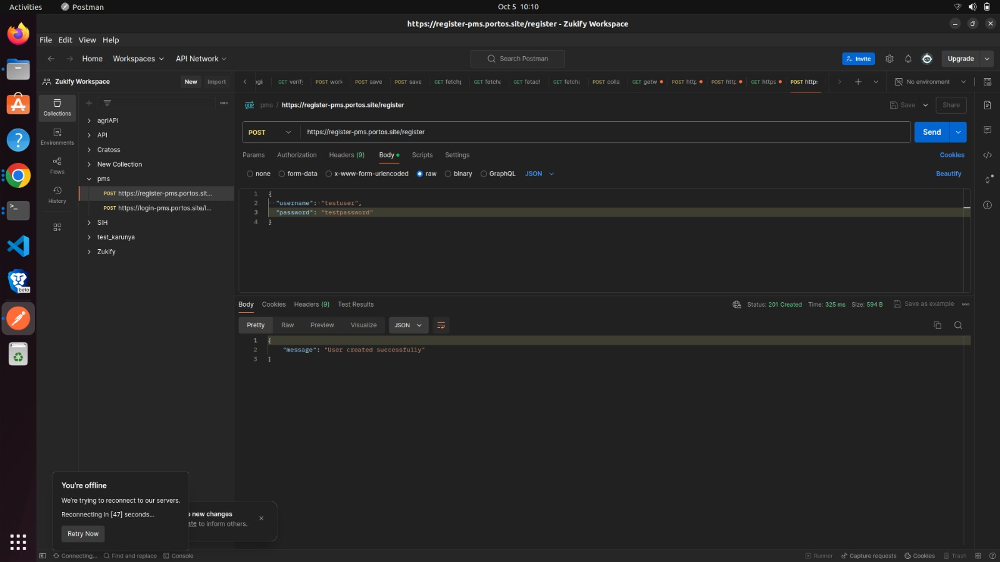
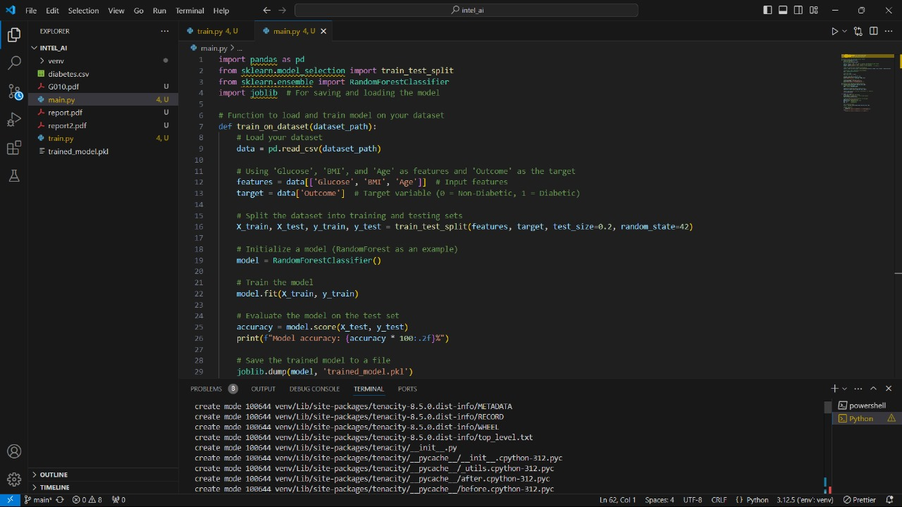
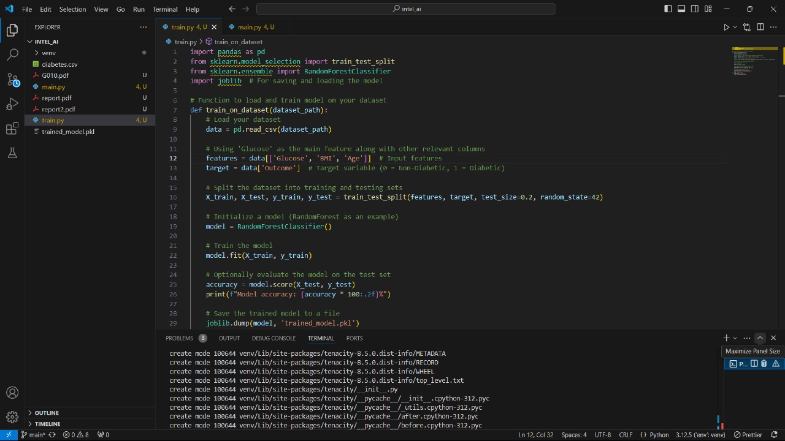
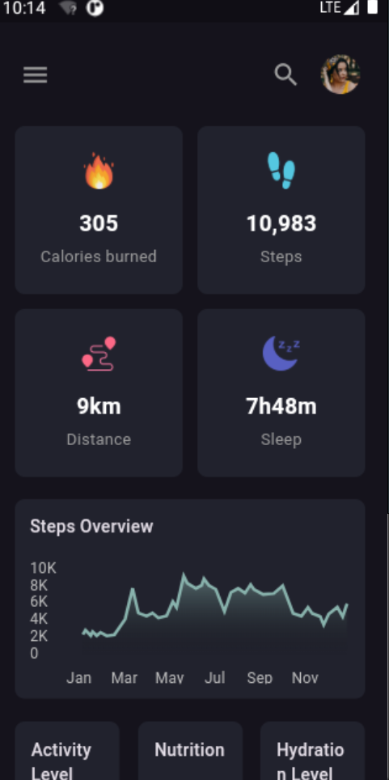

# Patient Monitoring System for Hospitals

## Overview

The **Patient Monitoring System** is an AI-driven platform designed to help hospitals efficiently track and monitor their patients by analyzing lab reports. Hospitals can upload patient lab reports through an admin portal, and the system will automatically retrieve relevant data to generate a detailed report. This report includes:

- **Medicine suggestions**
- **Diet plans**
- **Physical workouts**
- **Other personalized health recommendations**

These recommendations are powered by AI-driven models that interpret the data from the lab reports. Doctors can then review, modify, and approve the report, which will be reflected in the patient's mobile app. The mobile app also provides continuous notifications and helps track the patient’s health features.

---

## Features

- **Automated Report Generation:** Lab reports are automatically analyzed using AI models to generate suggestions for medicines, diet plans, and physical activities.
- **Doctor Review & Approval:** Doctors can verify and approve the generated reports before they are sent to patients.
- **Mobile App Notifications:** Patients receive consistent notifications about their health recommendations via the mobile app.
- **Real-Time Health Monitoring:** The app allows real-time tracking of patient health metrics based on lab reports and doctor feedback.

---

## Technology Stack

### Backend
- **Language:** GoLang
- **Framework:** Echo Framework

### AI Model
- **Languages & Tools:** Python, LangChain
- **Model:** Ollama's GEMMA-2 for AI-based lab report analysis and recommendation generation

### Frontend (Admin Portal)
- **Framework:** React.js
- **Styling:** Bootstrap

### Frontend (Mobile App)
- **Framework:** Flutter

---

## System Workflow

1. **Lab Report Upload:** Hospitals upload patient lab reports through the admin portal.
2. **Data Extraction & Analysis:** AI models process the uploaded lab report to extract data and generate health recommendations.
3. **Doctor Review:** Doctors receive the generated report and can modify it before approval.
4. **Patient App Notification:** Once the report is approved, the information is synced to the patient’s mobile app.
5. **Health Tracking:** Patients are notified of their health suggestions, including medications, diets, and physical workouts. The app continuously tracks the patient’s progress and sends reminders.

---

## How to Run

### Backend
1. Install GoLang and set up the Echo Framework.
2. Clone the repository and navigate to the backend directory.
3. Run the backend server:
   ```bash
   go run main.go
   ```
   
   

### AI Model
1. Set up a Python environment and install dependencies.
2. Integrate LangChain and Ollama's GEMMA-2 model.
3. Run the AI model service:
   ```bash
   python app.py
   ```
   
   

### Admin Frontend (React.js)
1. Navigate to the `admin-frontend` directory.
2. Install dependencies:
   ```bash
   npm install
   ```
3. Start the development server:
   ```bash
   npm start
   ```
   

### User Mobile App (Flutter)
1. Navigate to the `mobile-app` directory.
2. Install dependencies:
   ```bash
   flutter pub get
   ```
3. Run the app on an emulator or connected device:
   ```bash
   flutter run
   ```
   
---

## Future Enhancements

- **Multi-language support** for a more inclusive user experience.
- **Integration with wearable devices** for real-time data collection.
- **Advanced AI-driven insights** such as long-term health forecasting and preventive care recommendations.

---

## Contributing

We welcome contributions! Please submit pull requests and report issues via our GitHub repository. For larger changes, open an issue to discuss your proposal before submitting it.

---

## License

This project is licensed under the MIT License.

---